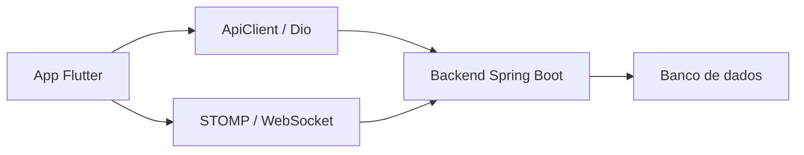

<div align="center">

# CollabResearch Mobile

**Aplicativo Flutter do sistema de gerenciamento de TCC.**

<p>
  
  
  
</p>

</div>

---

## Visao geral

Aplicativo mobile para consulta de dashboard, projetos, inscricoes, progresso, notificacoes, chat, perfil e configuracoes.

## Objetivo

Levar os principais fluxos do CollabResearch para celular, mantendo acesso rapido aos dados do usuario e as interacoes com o backend.

## Funcionalidades principais

- Login, cadastro e recuperacao de acesso.
- Dashboard com indicadores.
- Lista e detalhe de projetos.
- Inscricoes e acompanhamento de status.
- Chat entre usuarios.
- Notificacoes em tempo real.
- Perfil, configuracoes e feedback.

## Tecnologias utilizadas

- Flutter
- Dart
- Provider
- GoRouter
- Dio
- flutter_dotenv
- flutter_secure_storage
- stomp_dart_client
- cached_network_image
- fl_chart
- intl

## Estrutura do projeto

```text
tcc-mobile/
|-- lib/
|   |-- core/        # Configuracao, API, tema, auth e utilitarios
|   |-- models/      # Modelos de dominio
|   |-- providers/   # Estado global
|   |-- router/      # Rotas do app
|   |-- screens/     # Telas
|   |-- services/    # Requisicoes HTTP e STOMP
|   `-- widgets/     # Componentes reutilizaveis
|-- android/
|-- web/
|-- windows/
|-- test/
`-- pubspec.yaml
```

## Pre-requisitos

- Flutter SDK 3.3 ou superior
- Dart compatível com o Flutter instalado
- Android Studio, Xcode ou ambiente Flutter Web/Windows conforme a plataforma alvo
- Backend CollabResearch em execucao

## Configuracao de ambiente

Crie um arquivo `.env` na raiz do mobile com a URL da API:

```env
API_URL=http://localhost:8080
```

O arquivo e lido por `flutter_dotenv`.

## Instalacao

```bash
flutter pub get
```

## Como executar localmente

```bash
flutter run
```

## Como gerar build

Android:

```bash
flutter build apk
```

Web:

```bash
flutter build web
```

Windows:

```bash
flutter build windows
```

## Arquitetura resumida



O mobile consome a API HTTP do backend para CRUD e autentica o usuario com JWT. Conversas e notificacoes usam o canal em tempo real quando disponivel.

## Equipe do projeto

Nao informada nos arquivos do repositorio.

## Licenca

Nao ha arquivo de licenca no repositorio.
